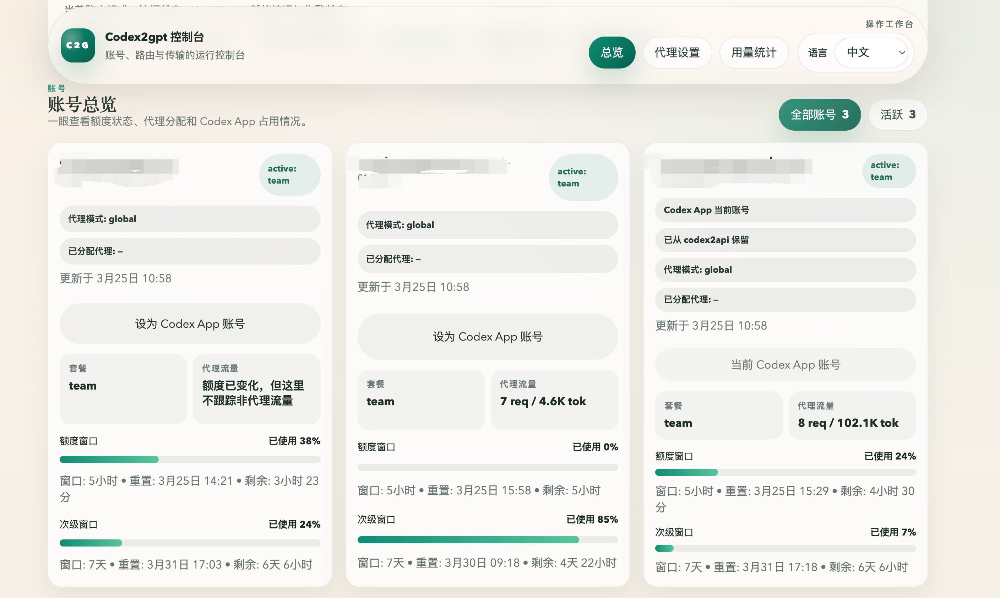
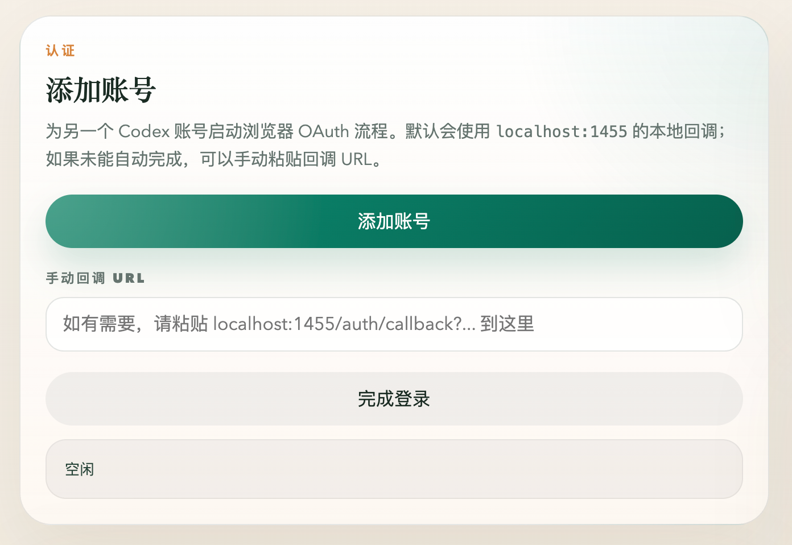

# codex2gpt

[English](./README_EN.md)

`codex2gpt` 是一个本地 Python 代理服务，用一套服务同时提供 OpenAI、Anthropic、Gemini 兼容接口，以及原生 `Responses API` 风格接口。

它适合放在本机或内网环境里，统一接入 Codex 账号池、代理路由、请求记录和基础运维面板。

## 仓库介绍

这个仓库主要做四件事：

- 把不同协议的请求统一转发到 Codex 后端
- 管理多个本地 OAuth 账号，并按策略分配请求
- 切换 Codex App 使用的登录账号，无需反复重新登录
- 提供一个轻量控制台，查看账号、代理和用量状态
- 作为本地统一入口，减少不同客户端分别适配的成本

当前已经支持的调用方式：

- OpenAI 兼容：`POST /v1/chat/completions`
- Anthropic 兼容：`POST /v1/messages`
- Gemini 兼容：`POST /v1beta/models/{model}:generateContent`
- 原生接口：`POST /v1/responses`

## 界面预览

账号信息页面：



这个页面用于查看账号总览、当前 Codex App 账号、套餐窗口、请求量和代理分配情况。

登录新账号页面：



这个页面用于发起浏览器 OAuth 登录，也支持在自动回调失败时手动粘贴回调 URL 完成登录。

## 适合什么场景

- 想把本地多个 Codex 账号集中成一个统一 API 入口
- 已有 OpenAI / Anthropic / Gemini 客户端，想尽量少改代码接入
- 需要本地控制台查看账号状态、配额窗口、代理和近期请求
- 需要在多个已登录账号之间切换 Codex App 使用账号，不想每次都重新登录
- 希望给 agent、脚本或内部工具提供稳定的本地中转层

## 安装方式

推荐直接在 Codex 里说：

```text
直接下载并启动这个仓库：https://github.com/shengshenglab/codex2gpt.git
```

如果你手动操作，也可以：

```bash
git clone https://github.com/shengshenglab/codex2gpt.git
cd codex2gpt
./run.sh start
```

## 启动前说明

- 需要 Python 3.11+
- `./run.sh start` 首次启动时，默认会尝试导入 `~/.codex/auth.json`
- 如果本机还没有这个文件，启动会失败，并提示你先登录 Codex 再执行 `./run.sh add-auth oauth-01`

最顺手的方式是：

1. 先在本机登录 Codex
2. 确认存在 `~/.codex/auth.json`
3. 再运行 `./run.sh start`

## 使用方法

### 1. 启动服务

```bash
./run.sh start
```

常用命令：

```bash
./run.sh status
./run.sh stop
./run.sh restart
./run.sh add-auth oauth-02
```

### 2. 打开控制台

- Dashboard: [http://127.0.0.1:18100/](http://127.0.0.1:18100/)
- Health: [http://127.0.0.1:18100/health](http://127.0.0.1:18100/health)

### 3. 管理账号

- 如果本机已有 `~/.codex/auth.json`，`run.sh` 会在首次启动时自动导入到 `runtime/accounts/oauth-01.json`
- 如果你已经登录新的 Codex 账号，可以继续执行 `./run.sh add-auth oauth-02`
- 服务运行后，也可以在 Dashboard 里走浏览器 OAuth 流程添加账号
- 管理平台支持切换 Codex App 使用账号。账号都登录进来后，后续只需要在平台里点击目标账号设为 `Codex App` 账号即可，不需要来回重新登录
- 这个切换本质上会把选中的账号写入 `~/.codex/auth.json`，供 Codex App 直接使用

### 4. 调用接口

查看模型列表：

```bash
curl http://127.0.0.1:18100/v1/models
```

调用原生 `Responses API`：

```bash
curl http://127.0.0.1:18100/v1/responses \
  -H 'Content-Type: application/json' \
  -d '{
    "model": "gpt-5.4",
    "input": "Reply with exactly OK.",
    "stream": false
  }'
```

调用 OpenAI Chat Completions：

```bash
curl http://127.0.0.1:18100/v1/chat/completions \
  -H 'Content-Type: application/json' \
  -d '{
    "model": "gpt-5.4",
    "messages": [
      { "role": "user", "content": "Say hello." }
    ],
    "stream": false
  }'
```

调用 Anthropic Messages：

```bash
curl http://127.0.0.1:18100/v1/messages \
  -H 'Content-Type: application/json' \
  -H 'anthropic-version: 2023-06-01' \
  -d '{
    "model": "claude-opus-4-6",
    "max_tokens": 256,
    "messages": [
      { "role": "user", "content": "Say hello." }
    ],
    "stream": false
  }'
```

调用 Gemini 兼容接口：

```bash
curl http://127.0.0.1:18100/v1beta/models/gpt-5.4:generateContent \
  -H 'Content-Type: application/json' \
  -d '{
    "contents": [
      {
        "role": "user",
        "parts": [{ "text": "Say hello." }]
      }
    ]
  }'
```

## 核心特性

- 多协议兼容，尽量复用现有客户端
- 多账号轮转，支持 `least_used`、`round_robin`、`sticky`
- 支持结构化输出和工具调用
- 自带 Dashboard，便于查看账号、代理、用量和近期请求
- 运行时状态本地落盘，便于排查和恢复

## 运行时目录

服务会把本地状态写到 `runtime/` 下，常见内容包括：

- `runtime/accounts/*.json`
- `runtime/state.sqlite3`
- `runtime/settings.json`
- `runtime/cookies.json`
- `runtime/fingerprint-cache.json`
- `runtime/transcripts/`

这些属于运行时数据，不建议当作源码直接修改或提交。

## 给 Agent 的文档

- 仓库介绍：[`AGENT_OVERVIEW.md`](./AGENT_OVERVIEW.md)
- API 使用方法：[`AGENT_INTEGRATION.md`](./AGENT_INTEGRATION.md)

## 仓库结构

```text
.
├── app.py
├── codex2gpt/
│   ├── events.py
│   ├── protocols/
│   ├── schema_utils.py
│   └── state_db.py
├── run.sh
├── runtime/
├── tests/
└── web/
```
